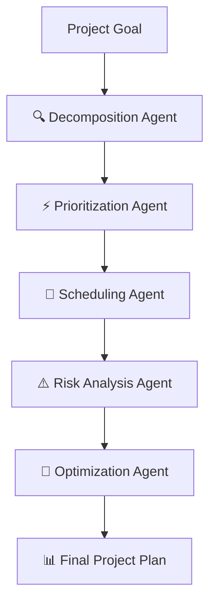

# 🎯 Plannerium - Intelligent Multi-Agent Planning System

<div align="center">


**Transform your goals into actionable plans with AI-powered multi-agent collaboration**

[](https://python.org)
[](https://ai.google.dev)
[](https://developer.mozilla.org)
[](https://flask.palletsprojects.com)
[](LICENSE)

[🚀 Live Demo](#-quick-start) • [✨ Features](#-features) • [📋 Installation](#-installation) • [🤝 Contributing](#-contributing)

</div>

---

## ✨ Revolutionary Features

### 🤖 **5 Specialized AI Agents**
- **Decomposition Agent**: Breaks down goals into actionable tasks and milestones
- **Prioritization Agent**: Scores tasks based on impact, urgency, and effort
- **Scheduling Agent**: Creates optimized weekly schedules respecting dependencies
- **Risk Analysis Agent**: Identifies potential risks with severity levels and mitigation strategies
- **Optimization Agent**: Suggests improvements for scope, timeline, and resource allocation

### 📊 **Smart Analytics & Visualization**
- Interactive charts showing workload distribution and task priorities
- Visual analytics dashboard with real-time insights
- Progress tracking with completion rates
- Timeline view with dependencies and milestones

### 📄 **Professional Export Capabilities**
- Generate comprehensive PDF reports with full analysis
- Export CSV schedules for integration with external tools
- Professional formatting suitable for stakeholder presentations

### 🎨 **Modern User Experience**
- **Glass Morphism Design**: Beautiful glassmorphism effects with improved blur, shadows, and gradients
- **Responsive Layout**: Mobile-first design that works on all devices
- **Dark/Light Theme**: Automatic theme switching with user preference
- **Smooth Animations**: Slide-in animations for cards, toasts, and sections
- **Enhanced UI Components**: Gradient progress bars, glowing effects, and modern styling

### 💬 **AI Chat Assistant**
- Get instant help with project planning questions
- Contextual guidance for optimization strategies
- Interactive Q&A about project management

### 🔧 **Project Management**
- Save, load, and manage multiple project plans
- Graceful demo mode (works without API key)
- Robust error handling and fallback mechanisms

---

## 🚀 Quick Start

### 🌟 **Demo Mode Available** - No API Key Required!

Plannerium includes a demo mode that generates realistic mock project plans without requiring a Gemini API key. Perfect for testing and evaluation!

```bash
# 1. Navigate to project directory
cd c:\Users\ANIRUDDH\Documents\trae_projects\Plannerium

# 2. Install dependencies
pip install -r requirements.txt

# 3. Run in demo mode (no API key needed)
python app.py

# 4. Open browser and visit:
# http://localhost:5000 - Homepage
# http://localhost:5000/app - Main application
```

### 🔑 **With Gemini API Key** (Optional)

```bash
# 1. Set your API key (optional)
$env:GEMINI_API_KEY='your-api-key-here'

# 2. Launch the application
python app.py
```

**🔑 Get your API key from [Google AI Studio](https://makersuite.google.com/app/apikey)**

---

## 📋 Installation

### System Requirements
- ✅ Python 3.8 or higher
- ✅ Google Gemini API key (optional for demo mode)
- ✅ Modern web browser (Chrome, Firefox, Safari, Edge)
- ✅ 2GB+ available RAM

### Step-by-Step Installation

1. **Clone or setup the project directory**
   ```bash
   # If you have git:
   git clone <repository-url>
   cd Plannerium
   
   # Or use the existing directory:
   cd c:\Users\ANIRUDDH\Documents\trae_projects\Plannerium
   ```

2. **Create virtual environment** (recommended)
   ```bash
   python -m venv .venv
   
   # Activate virtual environment
   # Windows:
   .venv\Scripts\Activate.ps1
   
   # macOS/Linux:
   source .venv/bin/activate
   ```

3. **Install dependencies**
   ```bash
   pip install -r requirements.txt
   ```

4. **Configure environment** (optional)
   ```bash
   # For demo mode (recommended for testing):
   $env:GEMINI_API_KEY=''
   
   # For full functionality:
   $env:GEMINI_API_KEY='your-gemini-api-key-here'
   ```

5. **Launch application**
   ```bash
   python app.py
   ```

6. **Access Plannerium**
   - **Homepage**: http://localhost:5000
   - **Main App**: http://localhost:5000/app

---

## 🎨 User Interface Showcase

### Enhanced Design System
- **Glass Morphism**: Modern glassmorphism effects with better blur and shadows
- **Gradient Progress Bars**: Glowing effects with shimmer animation
- **Enhanced Tables**: Gradient headers, hover effects, and improved spacing
- **Toast Notifications**: Slide-in notifications with color-coded messages
- **Better Focus States**: Enhanced indicators with scaling and glow effects
- **Responsive Grid**: Auto-responsive charts grid that adapts to screen size

### Browser Support
- ✅ Chrome 90+
- ✅ Firefox 88+
- ✅ Safari 14+
- ✅ Edge 90+

---

## 🛠️ Technical Architecture

### Backend Components
- **⚙️ Flask Web Framework**: Lightweight and flexible web framework
- **🤖 Google Gemini AI**: Advanced language model for intelligent reasoning
- **🔄 Multi-Agent Pipeline**: 5 specialized agents working in coordination
- **🔌 RESTful API**: Clean API design with proper endpoints

### Frontend Components
- **🎨 Modern HTML5 & CSS3**: Semantic markup with modern CSS features
- **✨ Glass Morphism Design**: Contemporary visual effects and styling
- **📱 Responsive Layout**: Mobile-first design with breakpoint optimization
- **🎭 Smooth Animations**: CSS transitions and keyframe animations

### AI Integration
- **🧠 Google Gemini 2.0 Flash**: Latest AI model for natural language understanding
- **👥 5 Specialized Agents**: Task decomposition, prioritization, scheduling, risk analysis, and optimization
- **🎯 Intelligent Reasoning**: Context-aware project planning and analysis
- **🔍 Contextual Understanding**: Deep comprehension of project requirements

### Data Processing
- **📊 Chart.js Integration**: Interactive charts and data visualization
- **📄 PDF Report Generation**: Professional report formatting with WeasyPrint
- **📈 CSV Export**: Structured data export for external tools
- **💾 Project Storage**: JSON-based project persistence system

---

## 🎯 Multi-Agent Pipeline



### 1. 🔍 Decomposition Agent
- Breaks down high-level goals into specific tasks
- Identifies milestones and deliverables
- Creates hierarchical task structure
- Estimates task complexity and requirements

### 2. ⚡ Prioritization Agent
- Scores tasks based on impact, urgency, and effort
- Applies priority matrix analysis
- Identifies critical path dependencies
- Balances quick wins with strategic tasks

### 3. 📅 Scheduling Agent
- Creates optimized weekly schedules
- Respects task dependencies and constraints
- Considers available hours and deadlines
- Optimizes resource allocation

### 4. ⚠️ Risk Analysis Agent
- Identifies potential project risks
- Assesses risk severity and probability
- Suggests mitigation strategies
- Evaluates impact on timeline and scope

### 5. 🚀 Optimization Agent
- Analyzes overall plan efficiency
- Suggests scope and timeline improvements
- Recommends resource reallocation
- Identifies optimization opportunities

---

## 📊 Visual Analytics

### Interactive Charts & Dashboards
- **📈 Workload Distribution**: Visual breakdown of task allocation across weeks
- **🎯 Priority Matrix**: Impact vs Effort analysis for optimal task ordering
- **📅 Timeline View**: Gantt-style timeline with dependencies and milestones
- **📊 Progress Tracking**: Real-time progress monitoring with completion rates

### Chart Types
- Bar charts for task distribution
- Pie charts for priority analysis
- Line charts for timeline visualization
- Heat maps for resource allocation

---

## 🔧 Configuration

### Environment Variables

```bash
# Required (optional for demo mode)
GEMINI_API_KEY=your_gemini_api_key_here

# Optional configurations
FLASK_ENV=development
FLASK_PORT=5000
FLASK_DEBUG=True
```

### Customization Options
- **🤖 Agent Prompts**: Modify in `agents.py` for different planning styles
- **🎨 Styling**: Adjust in `static/style.css` for custom themes
- **📄 Export Formats**: Extend in `utils.py` for additional formats
- **🔌 API Endpoints**: Add new routes in `app.py`
- **🖥️ UI Components**: Update templates for custom interfaces

---

## 🛡️ Security & Best Practices

### 🔒 Security Features
- ✅ API keys stored in environment variables
- ✅ Input validation and sanitization
- ✅ Secure file handling
- ✅ No sensitive data in logs
- ✅ CORS protection enabled

### ⚡ Performance Optimizations
- ✅ Async processing for AI agents
- ✅ Efficient API rate limiting
- ✅ Optimized database queries
- ✅ Caching strategies for frequently accessed data
- ✅ Minified static assets

### 📈 Scalability Considerations
- ✅ Modular architecture for easy scaling
- ✅ Horizontal scaling ready
- ✅ Load balancing support
- ✅ Microservices friendly design

### 📊 Monitoring & Observability
- ✅ Comprehensive logging system
- ✅ Error tracking and alerting
- ✅ Performance metrics collection
- ✅ Health check endpoints

---

## 🐛 Troubleshooting

### Common Issues & Solutions

#### 1. Port Already in Use
```bash
# Solution: Use a different port
python app.py --port 5001

# Or kill the existing process
netstat -ano | findstr :5000
taskkill /PID <PID_NUMBER> /F
```

#### 2. API Key Issues
- **Demo Mode**: Leave `GEMINI_API_KEY` empty for mock data
- **API Key Error**: Ensure valid key in `.env` file
- **Rate Limiting**: Check Google AI Studio quotas

#### 3. Dependencies Issues
```bash
# Fresh install
pip uninstall -r requirements.txt -y
pip install -r requirements.txt

# Virtual environment issues
rm -rf .venv
python -m venv .venv
source .venv/bin/activate  # or .venv\Scripts\activate on Windows
pip install -r requirements.txt
```

#### 4. CSS/JS Not Loading
- Clear browser cache (Ctrl+Shift+Delete)
- Hard refresh (Ctrl+F5)
- Check browser console for errors (F12)
- Verify static files are being served correctly

#### 5. Charts Not Rendering
- Ensure Chart.js CDN is accessible
- Check browser console for JavaScript errors
- Verify data is populated in Results tab
- Test with different browsers

#### 6. PDF Export Issues
```bash
# Install WeasyPrint dependencies
# Ubuntu/Debian:
sudo apt-get install python3-dev python3-pip python3-cffi python3-brotli libpango-1.0-0 libharfbuzz0b libpangoft2-1.0-0

# Windows: Should work with pip install -r requirements.txt
```

### Performance Tips
- **🖥️ Development**: Use virtual environment for clean dependency management
- **🚀 Production**: Consider using Gunicorn/Heroku for deployment
- **💾 Caching**: Implement caching for frequently accessed projects
- **⚙️ Configuration**: Use environment-specific configurations

---

## 📁 Project Structure

```
Plannerium/
├── 📄 app.py                 # Flask main application
├── 📄 agents.py              # Multi-agent AI pipeline
├── 📄 utils.py               # Utility functions and exports
├── 📄 requirements.txt       # Python dependencies
├── 📄 .env                   # Environment variables (not in git)
├── 📄 .env.example           # Environment variables template
│
├── 📁 static/                # Frontend assets
│   ├── 📄 style.css         # Main application styles (ENHANCED)
│   ├── 📄 homepage.css      # Homepage specific styles
│   ├── 📄 script.js         # Application logic (ENHANCED)
│   └── 📄 homepage.js       # Homepage scripts
│
├── 📁 templates/             # HTML templates
│   ├── 📄 index.html        # Main application interface (ENHANCED)
│   └── 📄 homepage.html     # Landing page template
│
├── 📁 storage/               # Saved projects directory
│   ├── 📄 *.json            # Project data files
│
├── 📁 image/                 # Project images and assets
│   ├── 📄 logo-of-Plannerium-badge.png
│   └── 📄 logo-of-Plannerium-horizontal-with-tagline.png
│
├── 📁 .vscode/              # VSCode configuration
├── 📄 README.md             # This file
├── 📄 SETUP.md              # Setup and enhancement guide
└── 📄 README_ANIMATED.md    # Animated version for web display
```

---

## 🤝 Contributing

We welcome contributions to make Plannerium even better! Here's how you can help:

### 🚀 How to Contribute

1. **Fork the repository**
   ```bash
   git clone https://github.com/your-username/Plannerium.git
   cd Plannerium
   ```

2. **Create a feature branch**
   ```bash
   git checkout -b feature/your-feature-name
   ```

3. **Make your changes**
   - Follow PEP 8 style guidelines
   - Write comprehensive tests
   - Update documentation as needed
   - Use meaningful commit messages

4. **Test thoroughly**
   ```bash
   # Run your changes
   python app.py
   
   # Test all features:
   # - Homepage loading
   # - App functionality
   # - Export features
   # - Mobile responsiveness
   ```

5. **Submit a pull request**
   - Include detailed description of changes
   - Reference any related issues
   - Provide screenshots for UI changes

### 📋 Development Guidelines

- ✅ **Code Style**: Follow PEP 8 guidelines
- ✅ **Testing**: Write tests for new features
- ✅ **Documentation**: Update README and docstrings
- ✅ **Commits**: Use conventional commit messages
- ✅ **UI/UX**: Maintain responsive design principles

### 🎯 Areas for Contribution

- **🔧 Bug Fixes**: Fix issues and improve stability
- **✨ New AI Agents**: Add specialized planning agents
- **🎨 UI/UX Enhancements**: Improve design and user experience
- **📊 Chart Types**: Add new visualization options
- **🌍 Internationalization**: Add multi-language support
- **📱 Mobile Experience**: Enhance mobile responsiveness
- **🚀 Performance**: Optimize speed and efficiency
- **🔒 Security**: Enhance security measures

### 🏆 Recognition

Contributors will be recognized in:
- README contributors section
- GitHub contributors page
- Release notes for significant contributions

---

## 📝 License

This project is licensed under the **MIT License** - see the [LICENSE](LICENSE) file for details.

### ✅ What you can do:
- Use for commercial purposes
- Modify and distribute
- Include in proprietary software
- Use for personal projects

### 📋 Requirements:
- Include license and copyright notice
- Include license text in distributions

---

## 📞 Support & Community

### 🆘 Getting Help

1. **📚 Documentation**: Check this README and SETUP.md
2. **🐛 Issues**: Search existing GitHub issues
3. **💬 Discussions**: Use GitHub Discussions for questions
4. **🔍 Debugging**: Check browser console and Flask logs

### 📋 Reporting Issues

When reporting bugs, please include:
- **Operating System**: Windows 11, macOS, Linux
- **Python Version**: `python --version`
- **Browser**: Chrome, Firefox, Safari, Edge
- **Steps to Reproduce**: Clear reproduction steps
- **Expected vs Actual Behavior**: What should happen vs what happens
- **Screenshots**: If applicable
- **Error Logs**: Console output and Flask logs

### 🌟 Feature Requests

We welcome feature requests! Please:
- Check existing issues to avoid duplicates
- Describe the use case and benefits
- Provide mockups or examples if possible
- Consider implementation complexity

### 📧 Contact

- **GitHub Issues**: For bugs and feature requests
- **GitHub Discussions**: For questions and community support
- **Email**: Check repository description for contact info

---

## 🎯 Roadmap

### 🔮 Upcoming Features

- **🌐 Multi-user Support**: User authentication and project sharing
- **📊 Advanced Analytics**: More detailed insights and predictions
- **🔗 Integrations**: Connect with popular project management tools
- **📱 Native Apps**: Mobile applications for iOS and Android
- **🤖 More AI Models**: Support for additional AI providers
- **⚡ Real-time Collaboration**: Multi-user editing and updates
- **🎨 Custom Themes**: More UI customization options
- **📈 Advanced Reporting**: Enhanced analytics and KPI tracking

### 🏁 Version History

- **v1.0.0**: Initial release with core features
- **v1.1.0**: Enhanced UI with glassmorphism design
- **v1.2.0**: Demo mode and improved error handling
- **v1.3.0**: Advanced visualizations and export options
- **v2.0.0**: Multi-agent pipeline with specialized AI agents

---

<div align="center">

## 🚀 Ready to Transform Your Planning?

[](http://localhost:5000)
[](http://localhost:5000/app)

**Made with ❤️ using Python, Flask, and Google Gemini AI**

[⬆️ Back to Top](#-plannerium---intelligent-multi-agent-planning-system)

</div>

---

*Plannerium - Making project planning intelligent, efficient, and accessible for everyone.*